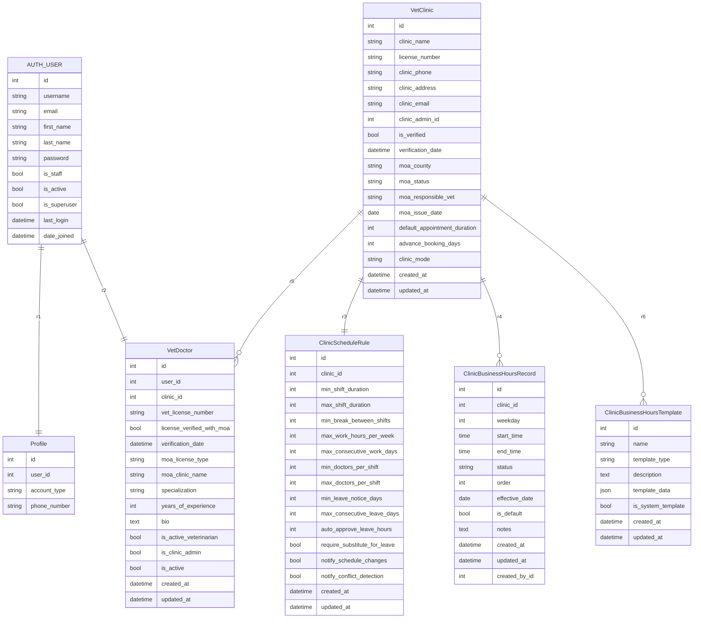
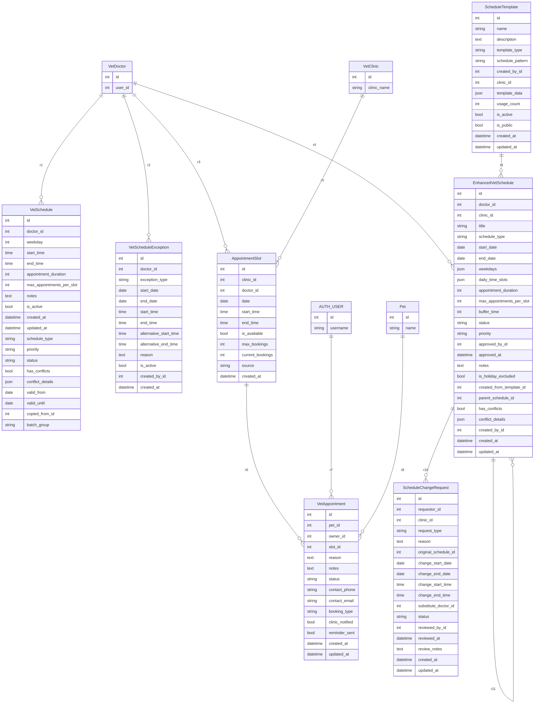
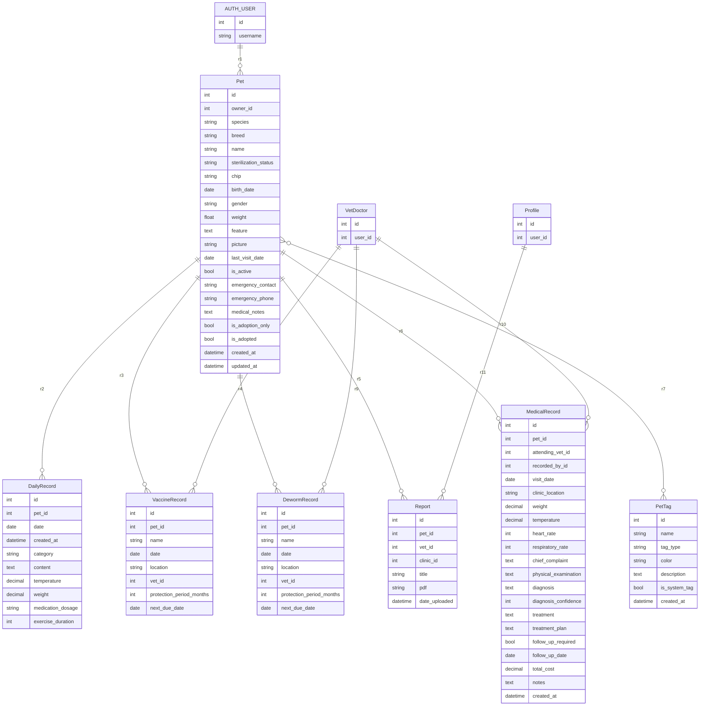
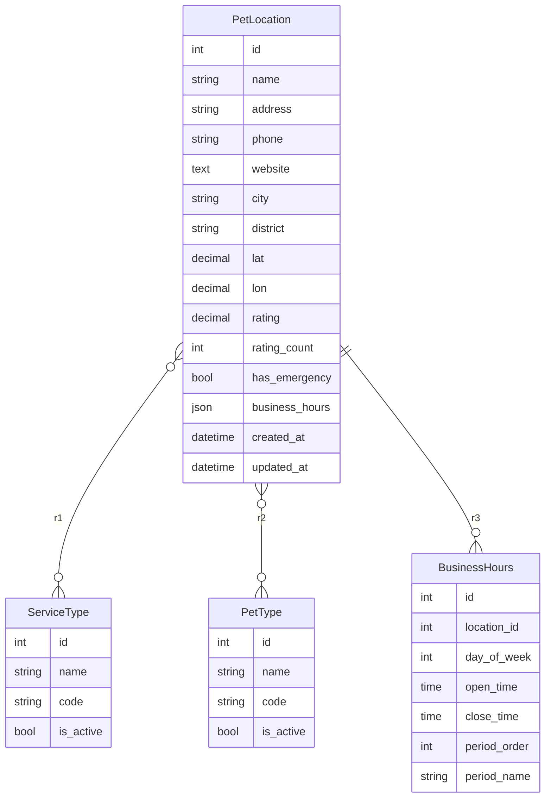
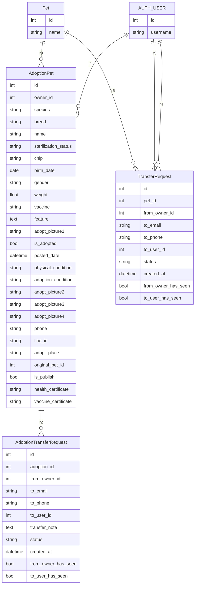
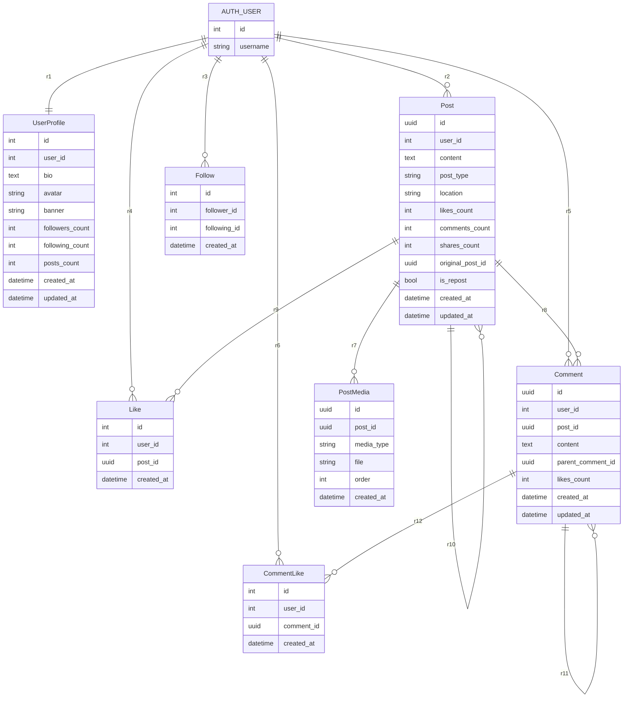
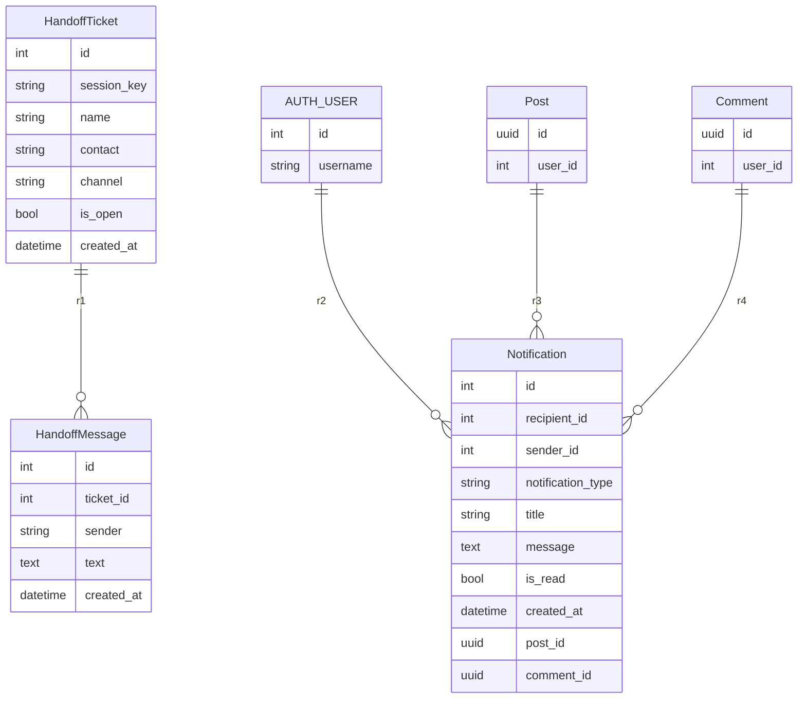
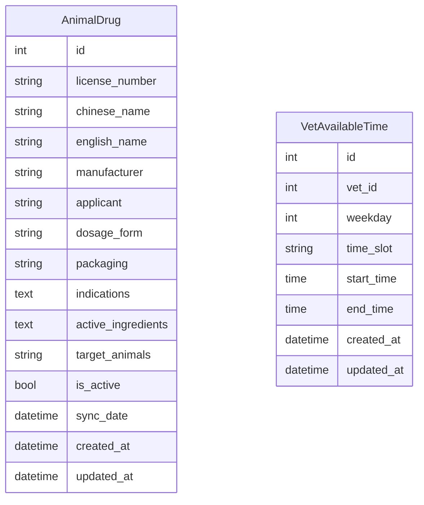

# PetApp ERD（分模組，含所有欄位）

_Generated: 2025-09-27T13:51:24_

以下 8 個模組皆為 GitHub 相容的 Mermaid ERD。

## 1) 診所與人員（Clinic & Staff）

## 2) 排班與預約（Scheduling & Booking）

## 3) 寵物、標籤與日誌（Pets, Tags & Daily）

## 4) 地點與服務（Locations & Services）

## 5) 領養（Adoption）

## 6) 社群（Social）

## 7) 客服與通知（Handoff & Notifications）

## 8) 其他資料（Other Data）

